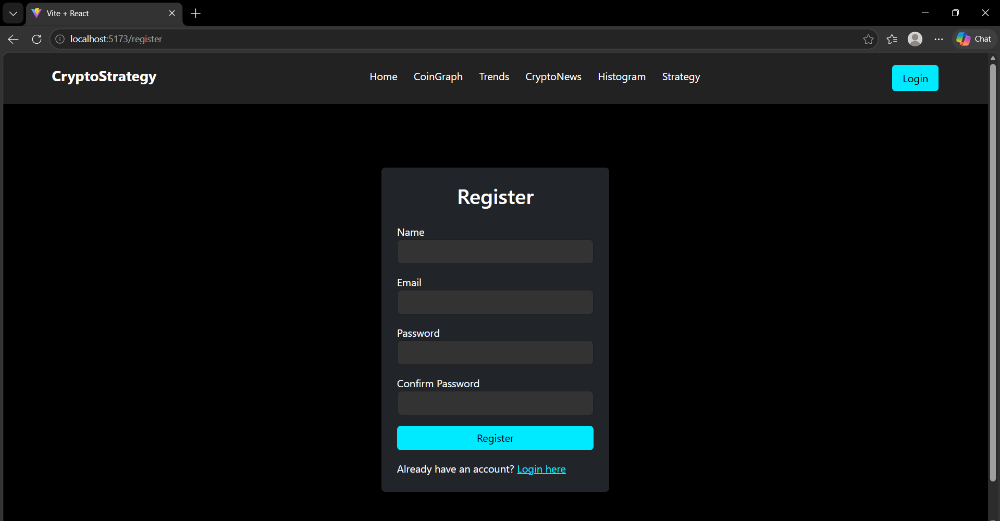
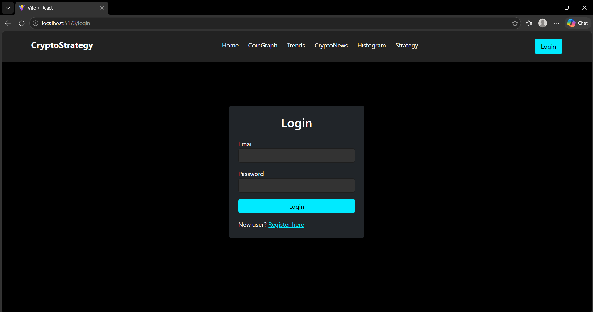
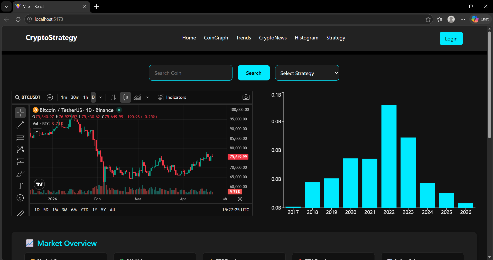
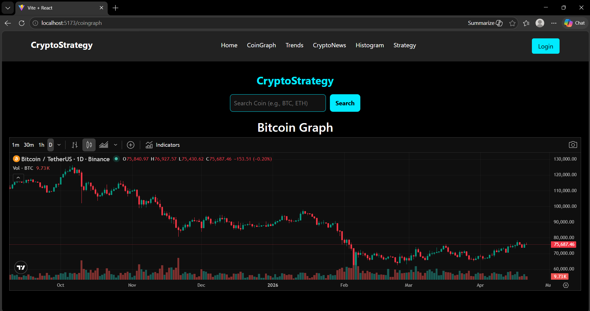
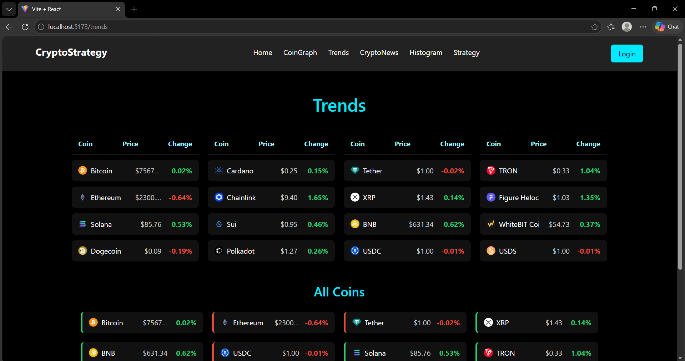
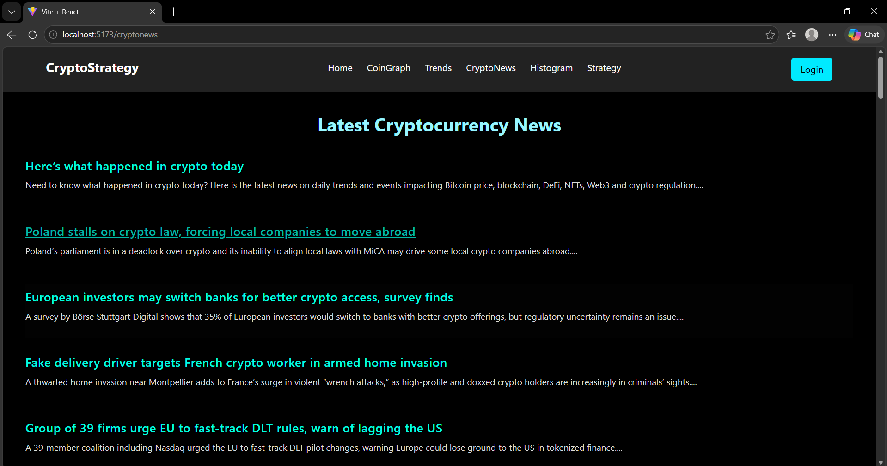
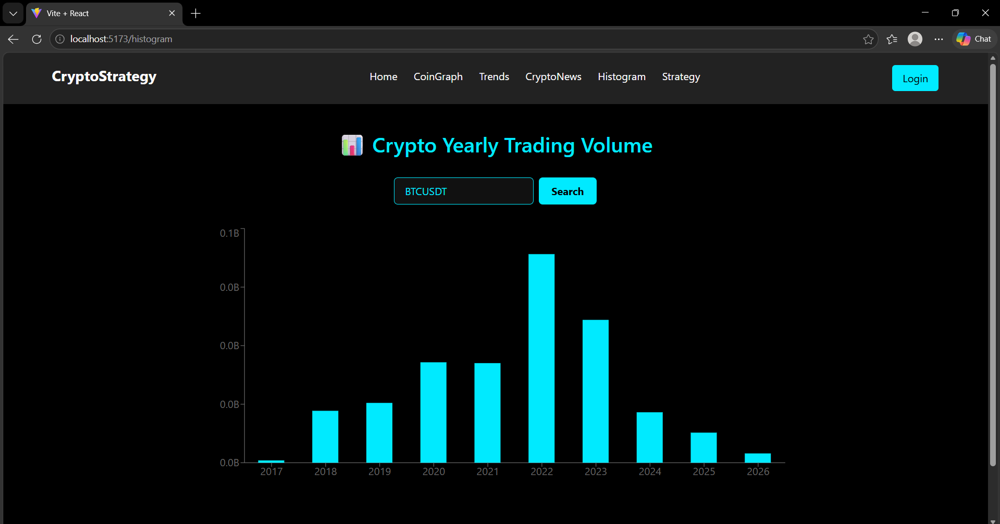
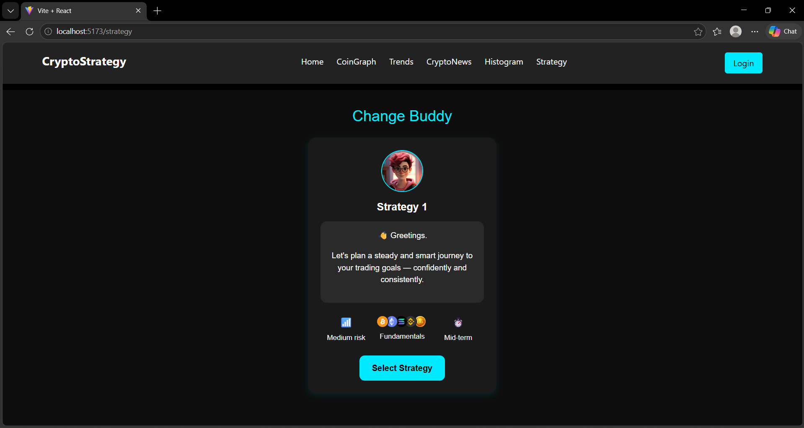

# Crypto Trading Assistant

## Project Overview

A real-time crypto trading assistant built using the MERN stack.
It analyzes live market data using technical indicators like EMA, MACD and RSI to generate buy/sell signals and help users make better trading decisions.

---

## Features

* Real-time crypto price tracking
* EMA, MACD, RSI indicator analysis
* Buy/Sell signal generation
* Interactive charts (TradingView integration)
* Volume trend visualization
* Strategy-based alerts

---

## Tech Stack

* Frontend : React.js
* Backend : Node.js, Express.js
* Database : MongoDB
* APIs : Crypto market APIs / TradingView

---

## Folder Structure

/client → Frontend (React)
/server → Backend (Node + Express)

---

## Installation & Setup

### Clone the repo

```
git clone https://github.com/SuvethaSekar/crypto-trading-assistant.git
```

### Install dependencies

```
cd client
npm install

cd ../server
npm install
```

### Run the project

```
# Start backend
cd server
npm start

# Start frontend
cd client
npm start
```

## 📸 Screenshots










---

## Future Improvements

* Add AI-based prediction
* Portfolio tracking
* User authentication

---
